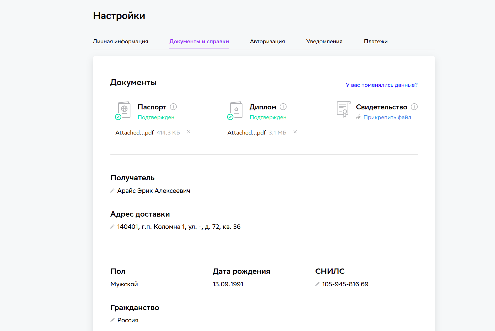

1. Получилось ли у вас загрузить документы подтверждающие вашу личность и диплом о высшем или среднем специальном образовании в личный кабинет?

Да, (если да, то прошу предоставить скриншот личного кабинета ссылкой)

2. Нужна ли вам справка об обучении после сдачи диплома? (Справка выдаётся всем студентам, в том числе тем, у кого нет диплома о высшем или среднем специальном образовании.)

Да

Для допуска к выполнению дипломной работы необходимо успешно завершить все модули входящие в профессию. Необходимо выполнить минимум 80% ДЗ на каждом модуле.

3. Удалось ли вам сдать минимум 80% ДЗ на каждом модуле профессии?

Да 

4. Какую тему дипломной работы вы выбрали?

● Track DevSecOps (Построение процессов безопасной разработки.
Автоматизация тестирования на безопасность на различных этапах
разработки)
Задание на построение безопасного пайплайна сборки и тестирования для pet-проекта.
Основная цель — внедрить практики безопасной разработки в виде статического и
динамического анализа.