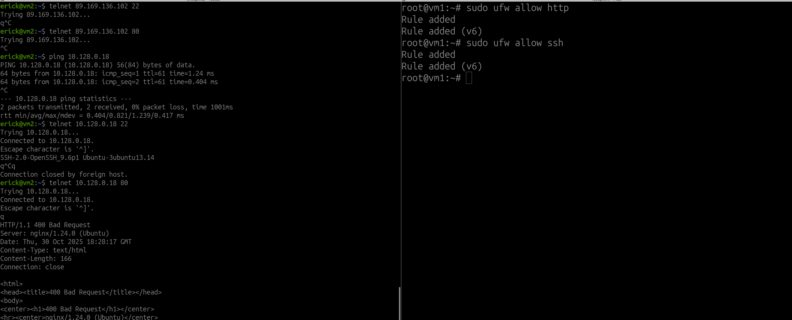

### Протоколы транспортного уровня: TCP, UDP

[Задание](https://github.com/netology-code/ibnet-homeworks/tree/v2/03_tcpudp)

### Ответ:

В процессе установления соединения при отключенном МЭ
Соединение не блакируется межсетевым экраном

А вот при включенном, все соединения блокируются
Если прописать правила для МЭ, мы достучимся до нужных портов
