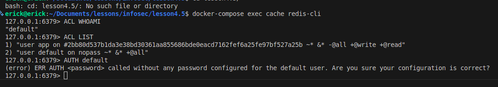
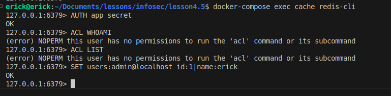
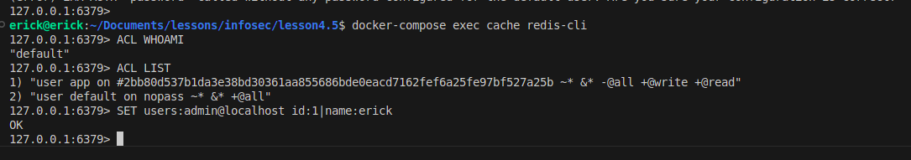

## Задание "Системы хранения данных: кеши, очереди, файловая система"

[Задание](https://github.com/netology-code/ibdev-homeworks/blob/master/05_storage/README.md)

1. По части 2: выводы команд ACL WHOAMI, ACL LIST, AUTH default.

2. По части 3: выводы команд ACL WHOAMI, ACL LIST.

3. По части 4: выводы команд ACL WHOAMI, ACL LIST.

