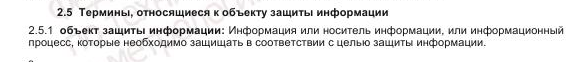

#  Нормативное регулирование

## Задача №1 - Физическая защита информации

При рассмотрении ГОСТ Р 50922-2006 мы указывали, что один из видов защиты информации - это физическая защита информации.

Физическая защита информации - защита информации путем применения организационных мероприятий и совокупности средств, создающих препятствия для проникновения или доступа неуполномоченных физических лиц к объекту защиты.

Интересно, а что относится к объектам защиты? Например, можно ли при определённых условиях считать здание объектом защиты? Для этого вам нужно прочитать примечание к определению термина Физическая защита информации в ГОСТ Р 50922-2006.

Найти ГОСТ по номеру можно на специальном сайте Росстандарта: http://protect.gost.ru. Для этого необходимо ввести его номер, например: ГОСТ Р 50922-2006.

Формат, в котором опубликованы ГОСТ'ы на этом сайте не очень удобен, поэтому многие пользуются альтернативными системами, например [Электронным фондом правовой и нормативно-технической документации](http://docs.cntd.ru).

Суть задания: вам нужно найти этот ГОСТ и найти примечание к термину Физическая защита информации, в котором и будет ответ на указанный вопрос. Вам необходимо указать:
1. Может ли здание считаться объектом защиты информации
1. На основании чего вы даёте тот или иной ответ (привести цитату из документа)

Ответ должен быть сформулирован в формате: "Да, является (или нет, не является), поскольку в документе <название документа> указано следующее: <цитата, подтверждающая ваше заключение>".

Ответ:

Да, здание не может считаться объектом защиты информации, поскольку в документе ГОСТ Р 50922-2006 «Защита информации. Основные термины и определения» указано следующее:

<!-- Исходя из найденной информации объектом защиты могут быть помещение, здание, сооружение, территория, транспортное средство и иные материальные объекты, в которых обрабатывается, хранится или передается защищаемая информация.  -->

Но в нём могут размещаться объекты защиты информации:

- серверы, компьютеры, архивы с документами (физические носители);
- системы обработки, хранения или передачи информации;
- персонал, осуществляющий информационные процессы.

## Задача №2 - Лицензия на ТЗКИ

ФСТЭК РФ ведёт на своём сайте [Реестр лицензий на деятельность по технической защите конфиденциальной информации](https://reestr.fstec.ru/)

Когда вы работаете на стороне Заказчика и планируете проведение работ по ТЗКИ, то привлекать необходимо организацию, которая обладает лицензией на соответствующий вид работ.

Соответственно, давайте проведём небольшое исследование и посмотрим, лицензией на проведение какого вида работ обладают компании, в которых работают наши лекторы:

Ответ:

1. [Гарда Технологии](https://gardatech.ru)

лицензия 3481 от 29.05.2018

срок действия бессрочно

Виды работ: б; е4; е5; е6

б - услуги по контролю защищенности конфиденциальной информации от несанкционированного доступа и ее модификации в средствах и системах информатизации;

е4 - программных (программно-технических) средств защиты информации;

е5 - защищенных программных (программно-технических) средств обработки информации;

е6 - программных (программно-технических) средств контроля эффективности защиты информации.

1. [Системный Софт](https://www.syssoft.ru)

лицензия 3009 от 02.09.2016 срок действия бессрочно Виды работ: а; б; г; д; е

а - услуги по контролю защищенности конфиденциальной информации от утечки по техническим каналам*** (а1...а4):

а1 - в средствах и системах информатизации;

а2 - в технических средствах (системах), не обрабатывающих конфиденциальную информацию, но размещенных в помещениях, где она обрабатывается;

а3 - в помещениях со средствами (системами), подлежащими защите;

а4 - в помещениях, предназначенных для ведения конфиденциальных переговоров (далее - защищаемые помещения);

б - услуги по контролю защищенности конфиденциальной информации от несанкционированного доступа и ее модификации в средствах и системах информатизации;

г - работы и услуги по аттестационным испытаниям и аттестации на соответствие требованиям по защите информации (г1...г3):

г1 - средств и систем информатизации;

г2 - помещений со средствами (системами) информатизации, подлежащими защите;

г3 - защищаемых помещений;

д - работы и услуги по проектированию в защищенном исполнении (д1...д3):

д1 - средств и систем информатизации;

д2 - помещений со средствами (системами) информатизации, подлежащими защите;

д3 - защищаемых помещений;

е - услуги по установке, монтажу, наладке, испытаниям, ремонту средств защиты информации (е1...е6):

е1 - технических средств защиты информации;

е2 - защищенных технических средств обработки информации;

е3 - технических средств контроля эффективности мер защиты информации;

е4 - программных (программно-технических) средств защиты информации;

е5 - защищенных программных (программно-технических) средств обработки информации;

е6 - программных (программно-технических) средств контроля эффективности защиты информации.