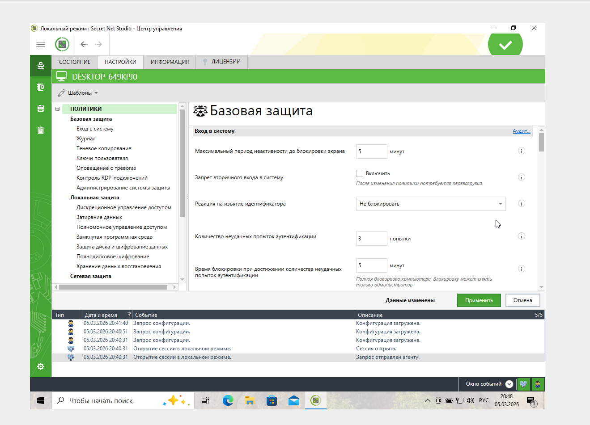
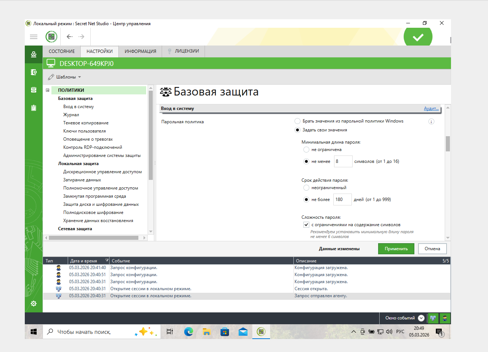
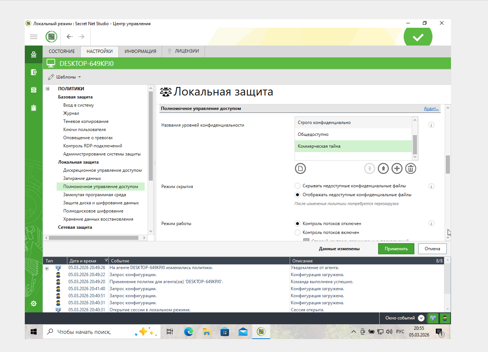
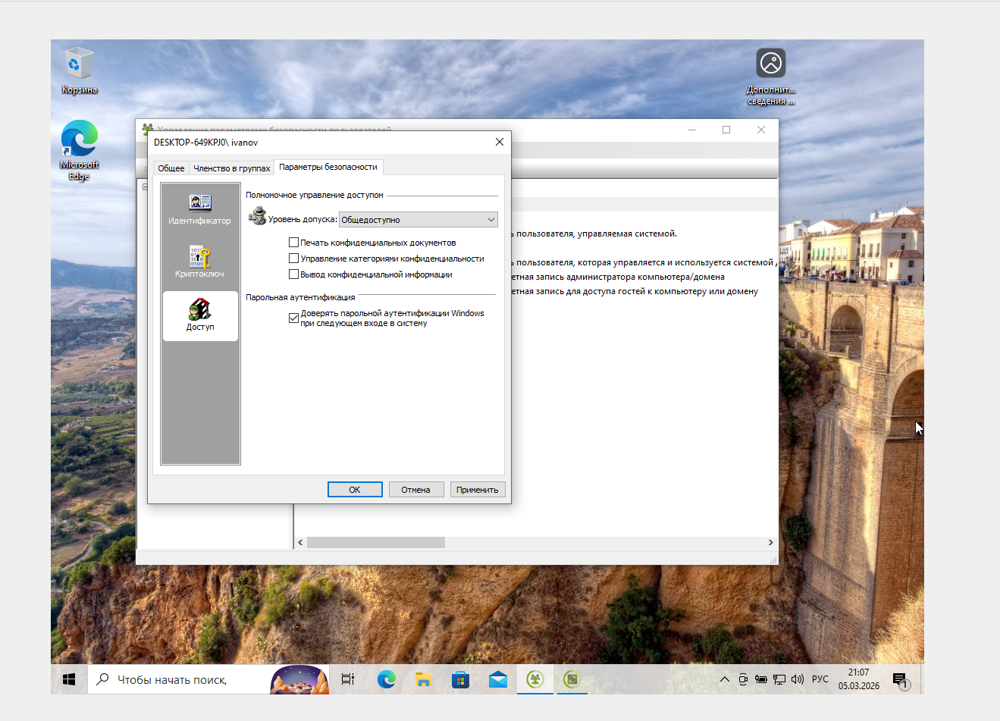
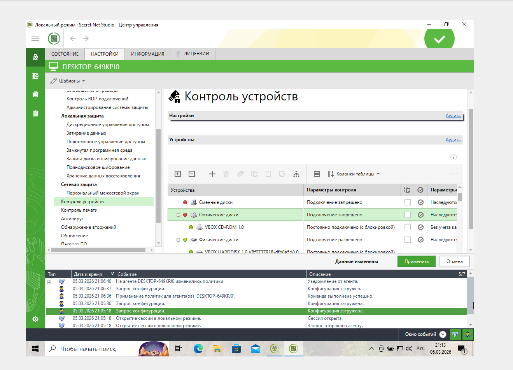
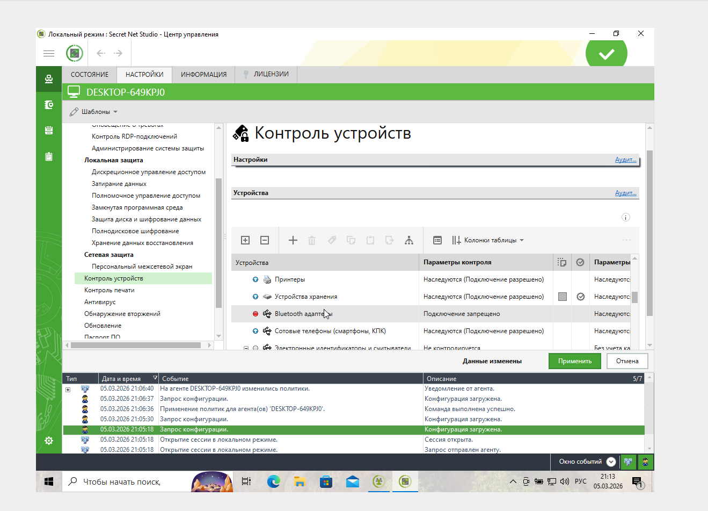
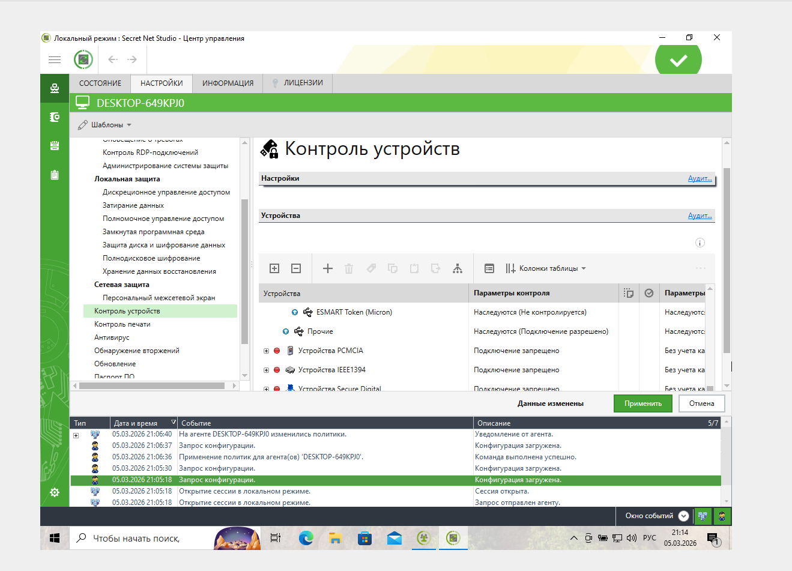
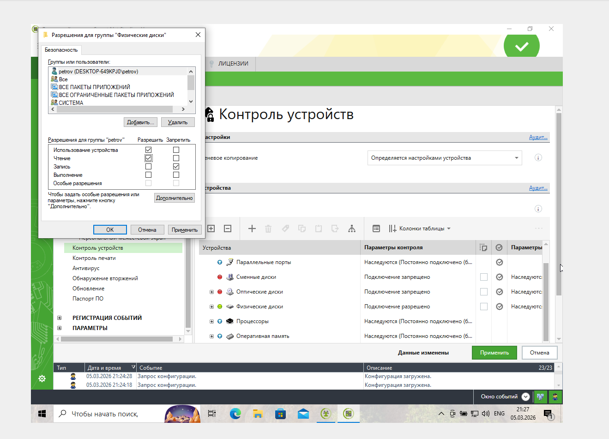

# СЗИ от несанкционированного доступа

### Задание 2. Настройка параметров входа в систему

Настройте параметры входа в систему, установив:
1. «Максимальный период неактивности до блокировки экрана» - 5 минут,
2. «Количество неудачных попыток аутентификации» - 3 попытки,
3. «Время блокировки при достижении количества неудачных попыток аутентификации» - 5 минут,
4. «Парольная политика» - минимальная длина 8 символов, срок действия не более 180 дней, с ограничением на содержание символов.

В качестве ответов в личном кабинете пришлите на проверку скриншоты каждого этапа произведенных вами настроек.

### Задание 3. Настройка полномочного управления доступом

1. Задайте названия уровней конфиденциальности: общедоступно, коммерческая тайна.
2. Создайте двух пользователей с параметрами:
- `ivanov` - уровень допуска «общедоступно», доверять парольной аутентификации Windows при следующем входе в систему,
- `petrov` - уровень допуска «коммерческая тайна», печать конфиденциальных документов, вывод конфиденциальной информации, доверять парольной аутентификации Windows при следующем входе в систему.
3. Создайте на диске C папку «КТ». В этой папке создайте документ Word с содержанием «Коммерческая тайна».
4. Сделайте настройку полномочного управления доступом, чтобы пользователь `ivanov` не мог открыть конфиденциальный документ с коммерческой тайной.

В качестве ответов в личном кабинете пришлите на проверку скриншоты каждого этапа произведенных вами настроек.

### Задание 4. Настройка контроля устройств

1. Запретите использование:
- сменных дисков,
- оптических дисков,
- сетевых плат и модемов,
- bluetooth-адаптеров,
- сотовых телефонов (смартфонов, КПК),
- устройств PCMCIA,
- устройств IEEE1394,
- устройств Secure Digital.
2. Для «Устройств хранения» запретите запись пользователю `petrov`.

