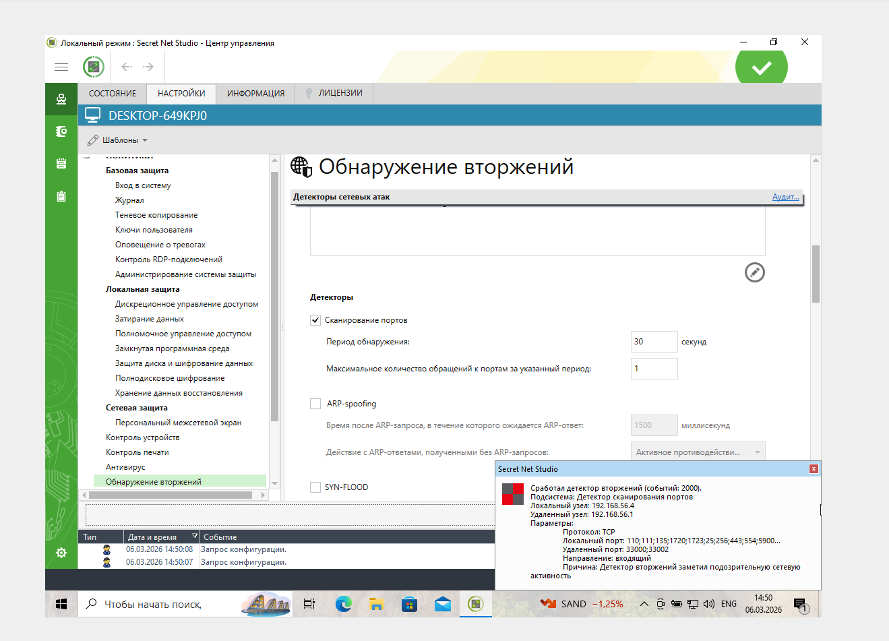
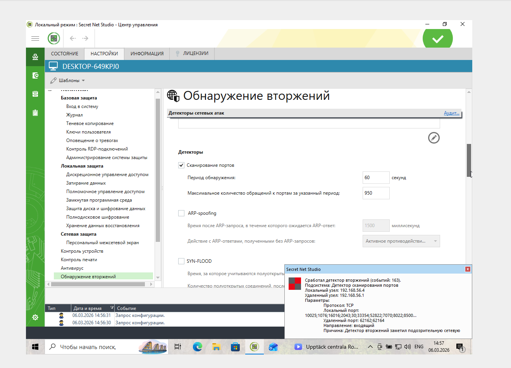
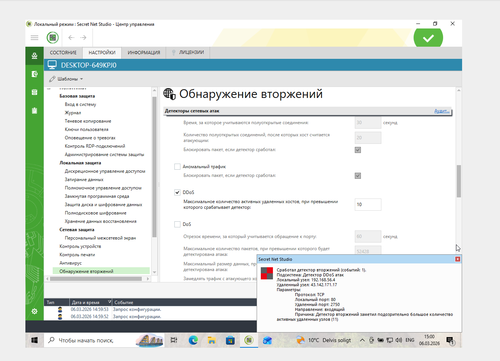
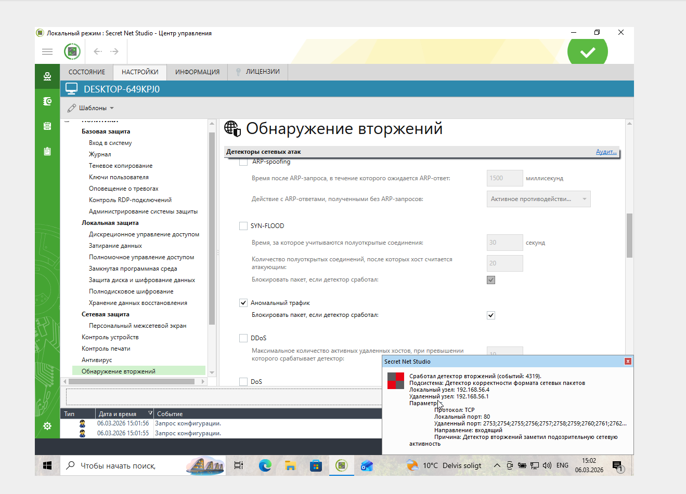

# IDS/IPS

## Инструкция к заданию

### Описание задачи

Вы - специалист по ИБ. Руководство компании приняло решение свести к минимуму возможные атаки на компьютер руководителя. Перед вами поставлена задача по настройке IDS/IPS Secret Net Studio.

Для того, чтобы выполнить эту задачу, вам необходимо подобрать оптимальные параметры, при которых IDS/IPS будет предотвращать вторжения на компьютер руководителя.

ВНИМАНИЕ! После каждого изменения параметров не забывайте нажимать кнопку «Применить», иначе настройки не активизируются.
Перед выполнением задания обязательно снимите галочку «Блокировка атакующего хоста при обнаружении атак». Это необходимо только в учебных целях, чтобы не ждать разблокировки.

### Задание 1. Сканирование портов

Для сканирования портов используйте Kali Linux, а именно – команду `sudo nmap <ip-адрес компьютера руководителя>`.
При сканировании выполните следующие действия.

1. В настройках «Обнаружение вторжений» в разделе «Детекторы» включите «Сканирование портов».
2. Период обнаружения оставьте без изменений - 60 секунд.
3. Подберите оптимальное значение «Максимальное количество обращений к портам за указанный период», при котором происходит предотвращение вторжения. Используйте шаг в 50. Например, при значении «100» СЗИ предотвращает вторжение, а уже при «150» - не срабатывает.

В качестве ответа пришлите значение, при котором начинает срабатывать IDS/IPS Secret Net Studio.

Ответ:



Для начала параметр «Максимальное количество обращений к портам за указанный период» был выставлен в 1000, запустил команду sudo nmap 192.168.56.4, и на виртуальной машине Windows 10 не сработал Secret Net. После уменьшения значения параметра до 950, детектор сработал:



### Задание 2. DDoS

Для DDoS-атаки используйте Kali Linux, а именно – команду `sudo hping3 -S -p 80 --rand-source <ip-адрес компьютера руководителя>`.
Эта команда имитирует отправку SYN-пакетов на 80 порт с нескольких хостов. Выполните следующие действия.

1. В настройках «Обнаружение вторжений» в разделе «Детекторы» выключите «Сканирование портов» и включите «DDoS».
2. Подберите оптимальное значение «Максимальное количество активных удаленных хостов, при превышении которого срабатывает детектор», при котором происходит предотвращение вторжения. Используйте шаг в 2. Например, при значении «30» СЗИ предотвращает вторжение, а при «32» – не срабатывает.

В качестве ответа пришлите значение, при котором начинает срабатывать IDS/IPS Secret Net Studio.

Ответ:

Уменьшая параметр на 2, выяснил, что детектор срабатывает при установленном значении 10:


### Задание 3. Аномальный трафик* (необязательное задание, не влияет на получение зачёта)

1. В настройках «Обнаружение вторжений» в разделе «Детекторы» выключите «DDoS» и включите «Аномальный трафик».
2. Самостоятельно изучите информацию о возможностях инструмента `hping3` и подберите команду, при которой сработает IDS/IPS Secret Net Studio.

Ответ:
```
sudo hping3 -S -p 80 --rand-source --flood 192.168.56.4
```

