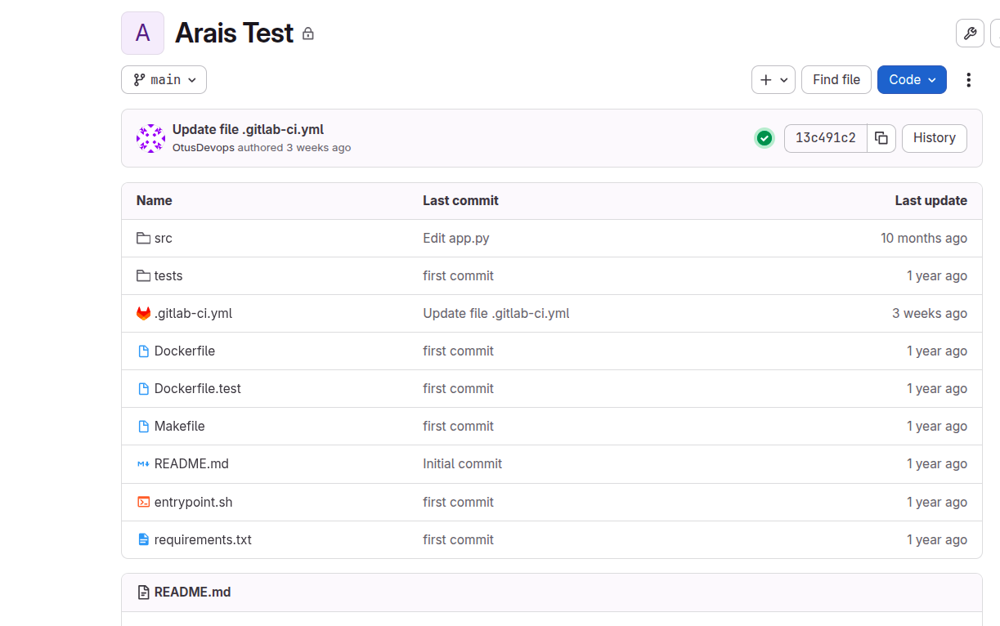
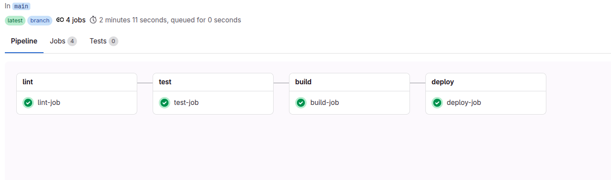
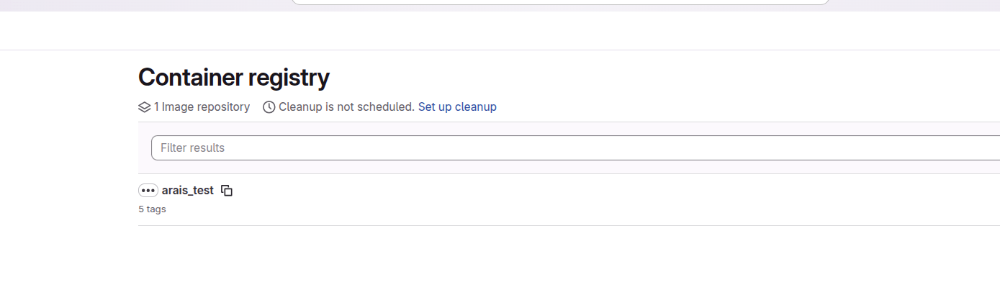

# Pipeline на GitLab

Решил использовать не GitVerse, а более актуальный инструмент  GitLab CI

создал проект



Проект представляет собой python web сайт написанный под Fest API

```
"""
Script: app.py
Description: This script serves as the entry point for a FastAPI application.
"""

from fastapi import FastAPI

app = FastAPI()

@app.get("/")
def health_check():
    """
    Health check endpoint.
    """
    return {"status": "ok"}
```

Так же добавил тест

```
"""
Module: test_app.py
Description: This module contains unit tests for the FastAPI application defined in app.py.
"""

from fastapi.testclient import TestClient

from src.app import app

def test_health_check():
    """
    Test the health check endpoint.
    """
    client = TestClient(app)
    response = client.get("/")
    assert response.status_code == 200
    assert response.json() == {"status": "ok"}
```

И собственно написал pipeline на его тестирование,сборку и деплой на виртаульную машину в Yandex Cloud
 

```
stages:
  - lint
  - test
  - build
  - deploy

# --- Переменные ---
variables:
  DOCKER_IMAGE_PROD: $CI_REGISTRY_IMAGE:$CI_COMMIT_SHA

# --- Общий before_script для Python-задач ---
.before-script: &before-script
  - export PYTHONPATH=$(pwd)
  - pip install --no-cache-dir -r requirements.txt

# --- Lint ---
lint-job:
  stage: lint
  image: python:3.11-slim-bookworm
  before_script:
    - *before-script
  script:
    - pylint src tests
  tags:
    - docker

# --- Test ---
test-job:
  stage: test
  image: python:3.11-slim-bookworm
  before_script:
    - *before-script
  script:
    - pytest --cov=src tests
  tags:
    - docker

# --- Build (с DinD) ---
build-job:
  stage: build
  image: docker:24.0
  services:
    - name: docker:24.0-dind
      alias: docker
      command: ["dockerd", "--host=tcp://0.0.0.0:2375", "--tls=false"]
  variables:
    DOCKER_DRIVER: overlay2
    DOCKER_HOST: "tcp://docker:2375"
  before_script:
    - sleep 10
    - docker version
    - docker login -u gitlab-ci-token -p "$CI_JOB_TOKEN" "$CI_REGISTRY"
  script:
    - docker build -t "$DOCKER_IMAGE_PROD" .
    - docker push "$DOCKER_IMAGE_PROD"
  tags:
    - docker

# --- Deploy по SSH ---
deploy-job:
  stage: deploy
  image: python:3.11-slim-bookworm
  variables:
    DEPLOY_HOST: "$SSH_USER@$SSH_HOST"
  before_script:
    - apt-get update && apt-get install -y --no-install-recommends openssh-client
    - mkdir -p ~/.ssh
    - echo "$SSH_PRIVATE_KEY" > ~/.ssh/key
    - chmod 600 ~/.ssh/key
    - ssh-keyscan "$SSH_HOST" >> ~/.ssh/known_hosts  # безопасная замена StrictHostKeyChecking=no
  script:
    - echo "Deploying to $DEPLOY_HOST"
    - |
      ssh -i ~/.ssh/key "$DEPLOY_HOST" "
        sudo apt update &&
        sudo apt install -y docker.io &&
        echo '$CI_REGISTRY_PASSWORD' | sudo docker login -u '$CI_REGISTRY_USER' --password-stdin '$CI_REGISTRY' &&
        sudo docker stop ci-practice 2>/dev/null || true &&
        sudo docker rm ci-practice 2>/dev/null || true &&
        sudo docker pull '$DOCKER_IMAGE_PROD' &&
        sudo docker run -d -p 8000:8000 --name ci-practice '$DOCKER_IMAGE_PROD'
      "
    - echo "Deployment complete"
  tags:
    - docker
```

Runner добавил с тегом docker, так как основной exporter docker, дал соответствующие права gitlab-runner'у

в итоге 






