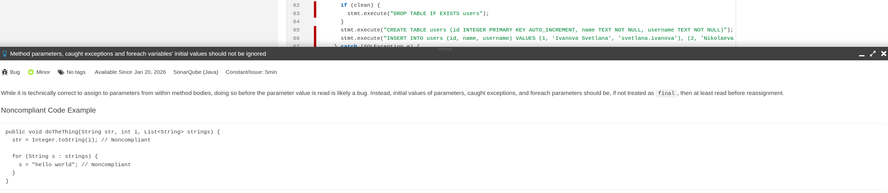
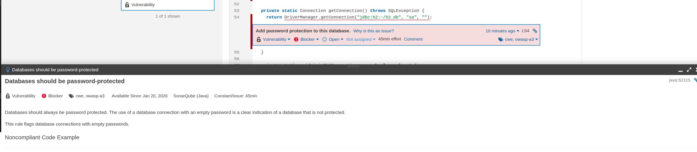
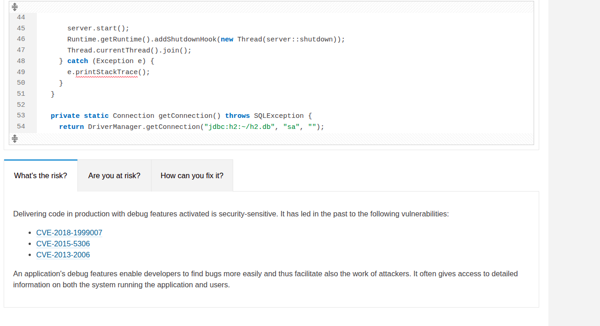
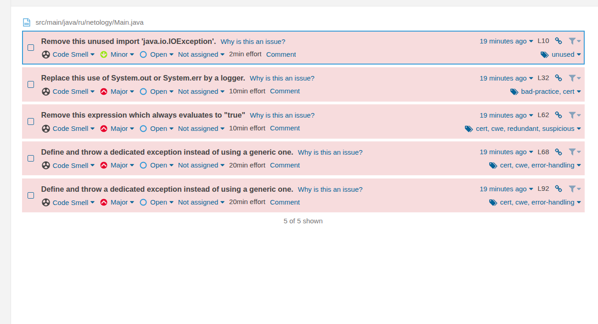

# Задание с проверкой работы SonarQube

Выполняем команду

```
docker-compose up --build ibdev.
```
### Какие баги были выявлены: количество, описание, почему SonarQube их считает багами? См. ссылку Why is this an issue?.



Был выявлен 1 баг, который говорит о то что присваивание значений параметрам метода, перехваченным исключениям или переменным цикла foreach до их первого чтения — почти всегда ошибка.

### Какие уязвимости были выявлены: количество, категории, описание, почему SonarQube их считает уязвимостями?



Была выявлена 1 уязвимость, которая содержит пустой пароль = отсутствие аутентификации. Любой, кто получит доступ к коду или среде выполнения, сможет подключиться к БД без каких-либо ограничений.

### Какие Security Hotspots были выявлены: количество, категории, приоритет, описание, почему SonarQube их считает Security HotSpot'ами?



Была выявлена 1 security hotspots, вывод стека исключения (printStackTrace()) в продакшен-коде — потенциальная угроза безопасности.
Примеры реальных уязыимостей
CVE-2018-1999007
CVE-2015-5306
CVE-2013-2006


CVE-2018-1999007
Уязвимость в некоторых Java-приложениях, где использование printStackTrace() в веб-контексте приводило к раскрытию внутренних путей, структуры кода и системной информации через HTTP-ответы — что помогало злоумышленникам в разведке.
CVE-2015-5306
Относится к проекту Apache Tomcat: при определённых ошибках сервер мог возвращать стек-трейсы в HTTP-ответах, раскрывая детали реализации, пути к файлам и версии компонентов — упрощая эксплуатацию других уязвимостей.
CVE-2013-2006
Уязвимость в Red Hat JBoss Operations Network: неправильная обработка ошибок приводила к утечке стека исключений в клиентские ответы, что позволяло атакующим получать информацию о внутренней архитектуре системы.

### К каким CWE идёт отсылка для Security Hotspots из п. 2? См. вкладку How can you fix it? в нижней части страницы.

OWASP Top 10 2017 Category A3 - Sensitive Data Exposure
MITRE, CWE-489 - Leftover Debug Code
MITRE, CWE-215 - Information Exposure Through Debug Information

### Какие запахи кода были выявлены: количество, описание, почему SonarQube их считает запахами кода? См. ссылку Why is this an issue?.



1. Неиспользуемые импорты снижают читаемость кода и могут вводить в заблуждение — кажется, что класс используется, хотя на самом деле нет.
IDE обычно удаляет их автоматически — ручное оставление — плохая практика.

2. Прямой вывод в System.out или System.err не позволяет:

- Контролировать уровень логирования (INFO, ERROR и т.д.),
- Форматировать логи единообразно,
- Безопасно логировать чувствительные данные,
- Централизованно собирать и хранить логи.
  

3. Если условие всегда истинно/ложно или не влияет на выполнение — это либо ошибка, либо мусорный код.
Пример: if (true) { ... } или if (a && a) — бессмысленно. Может скрывать логическую ошибку.

4. 5. Использование Exception, RuntimeException, Throwable как типа для throws или при выбрасывании — мешает точной обработке ошибок.
Код, который ловит Exception, не может отличить системную ошибку от бизнес-логической. Лучше создавать и использовать собственные исключения.